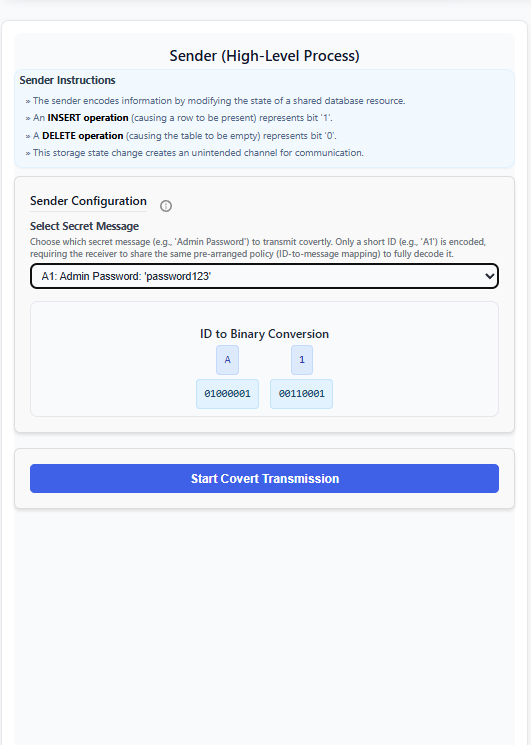
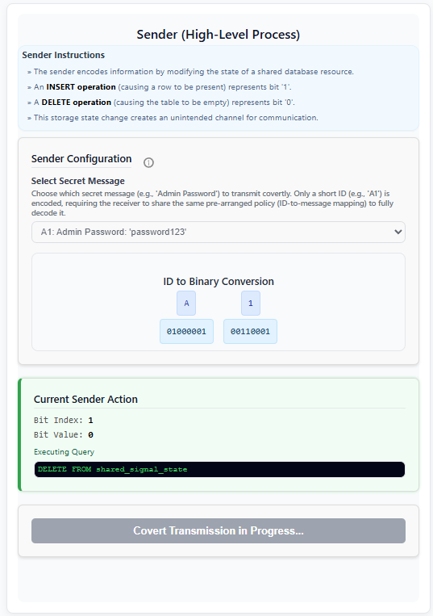
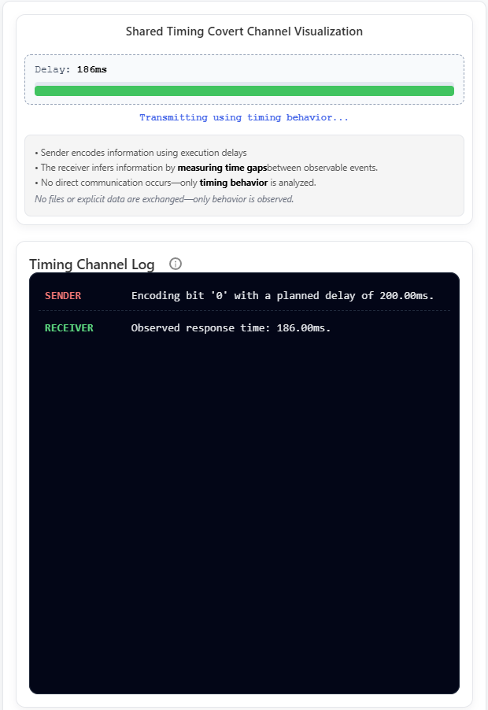
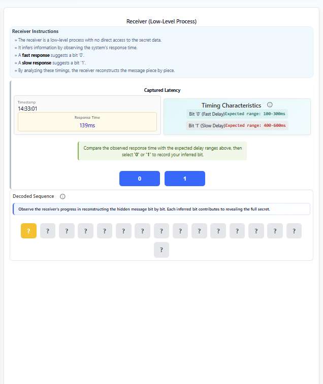
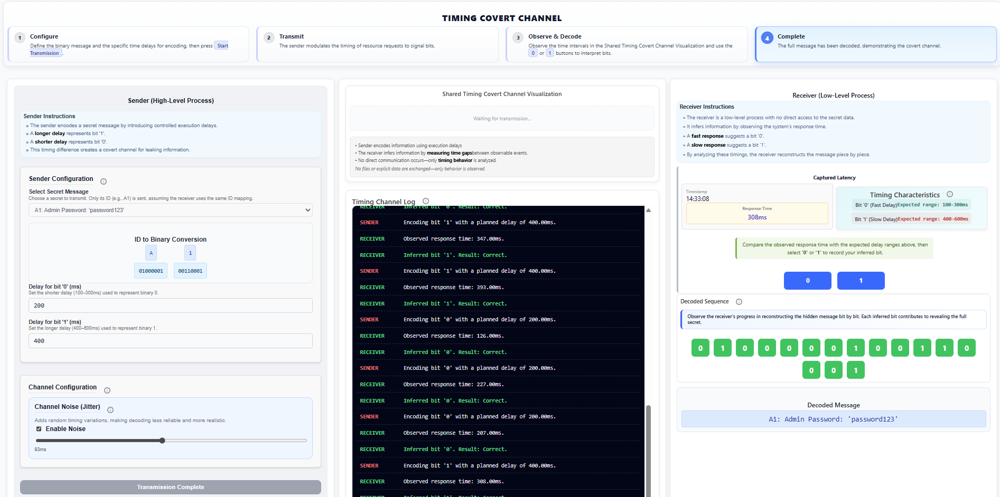

#### Introduction to Covert Channels

1. At the **top section of the screen**, observe the **Introduction to Covert Channels** panel.
2. In the **left panel (High-Security Sender Process)**:
   - Select a piece of classified information from the list.
   - Click **Attempt Data Transfer**.
3. In the **center panel (Access Control Enforcer)**:
   - Observe that the request is evaluated according to the security policy.
   - Note that the **No Write Down** rule is enforced and the request is blocked.
4. In the **right panel (Low-Security Receiver Process)**:
   - Observe that the incoming data displays **NULL (WRITE DENIED)**.
5. At the **bottom of the screen**, review the **System Audit Log**.
6. Click **Next: Covert Channel** to proceed.

#### 1: Storage Covert Channel

- In the **top navigation area**, select the **Storage Covert Channel** option.  
  

**Step 1: Sender Phase – Prepare and Start Transmission**

- In the **left panel (Sender – High-Level Process)**:  
  - Read the displayed sender instructions.  
  - Select a secret message from the **Select Secret Message** dropdown.  
  - Observe the **ID to Binary Conversion** displayed directly below the selection.  
    

- Click **Start Covert Transmission**.

- During transmission, monitor the **Current Sender Action** section in the left panel.  
  - Note that:  
    - A database **INSERT** operation represents bit `1`.  
    - A database **DELETE** operation represents bit `0`.  
  

**Step 2: Visualization Phase – Observe Shared Storage and Logs**

- In the **center panel (Shared Storage Covert Channel Visualization)**:  
  - Observe the **Shared Signal State Resource**.  
  - The visualization clearly indicates whether a row is present (signaling bit `1`) or the table is empty (signaling bit `0`).

- Below the visualization, monitor the **Database Action Log**, which records every covert channel operation (INSERT/DELETE) in chronological order.  
  

**Step 3: Receiver Phase – Decode and Recover the Message**

- In the **right panel (Receiver – Low-Level Process)**:  
  - Observe the database query result under **Database Observation**.  
  - Decode each bit by clicking **Decode 1** (when a row is present) or **Decode 0** (when the table is empty).  
    

- Watch the decoded bits appear in the **Decoded Bit Stream** section.

- If a mismatch occurs, click **Resume Decoding from Mismatch** and continue.

- Upon completion, confirm that the system displays **Transmission Complete**, indicating successful recovery of the hidden message.  
  

#### 2: Timing Covert Channel

- In the top navigation, select **Timing Covert Channel**.  
  

**Step 1: Sender – Encode and Start Transmission**

- In the **Sender (High-Level Process)** panel:  
  - Select a secret message from the dropdown.  
  - Configure the timing parameters:  
    - Delay for bit `0`  
    - Delay for bit `1`  
    - Optional noise (jitter) to simulate real-world variability  
  - Click **Start Transmission**.  
  

**Step 2: Visualization – Observe Timing Delays**

- In the **Shared Timing Covert Channel Visualization** panel:  
  - Observe the response time for each transmitted bit.  
  - Note how the timing pattern reveals the hidden information (longer or shorter delays correspond to bits `0` or `1`).  
  

**Step 3: Receiver – Decode and Recover the Message**

- In the **Receiver (Low-Level Process)** panel:  
  - Compare each observed response time against the expected delay ranges for bits `0` and `1`.  
  - Manually classify each bit by clicking **0** or **1** based on the measured timing.  
  

- Monitor the **Decoded Sequence**, which updates in real time as each bit is classified.

- Continue until all bits have been processed.

- Upon completion:  
  - Observe the final **Decoded Message** displayed.  
  - Review the **Timing Channel Log** to analyze how timing variations enabled the transmission of hidden data.  
  