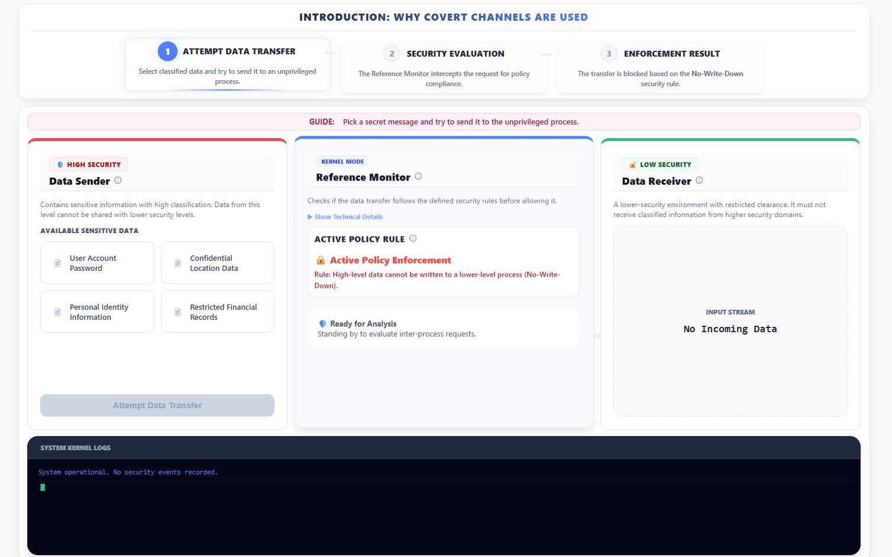
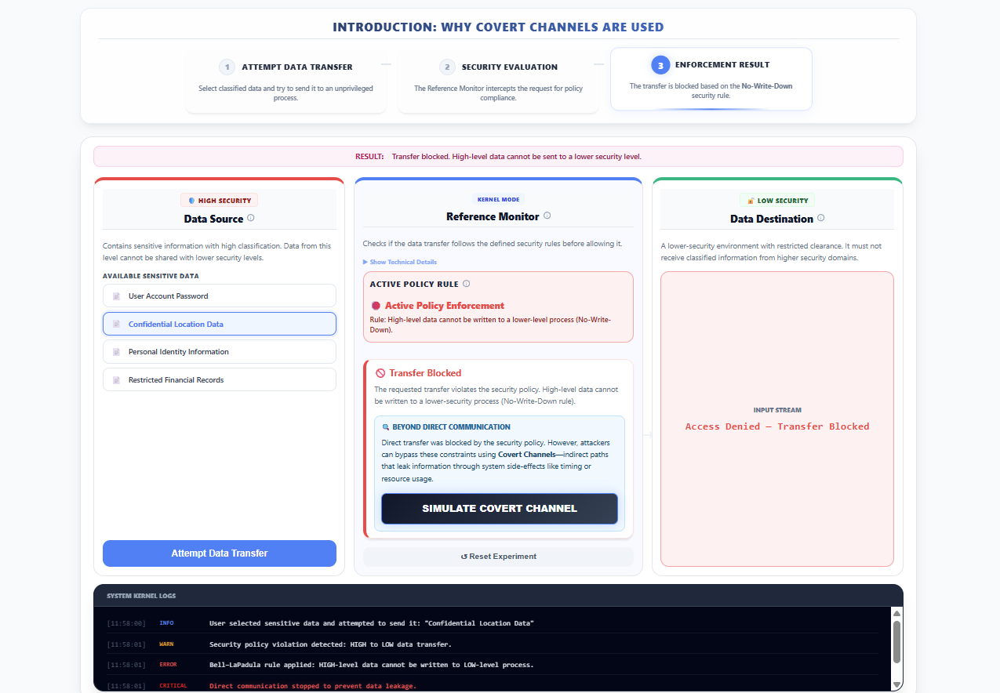
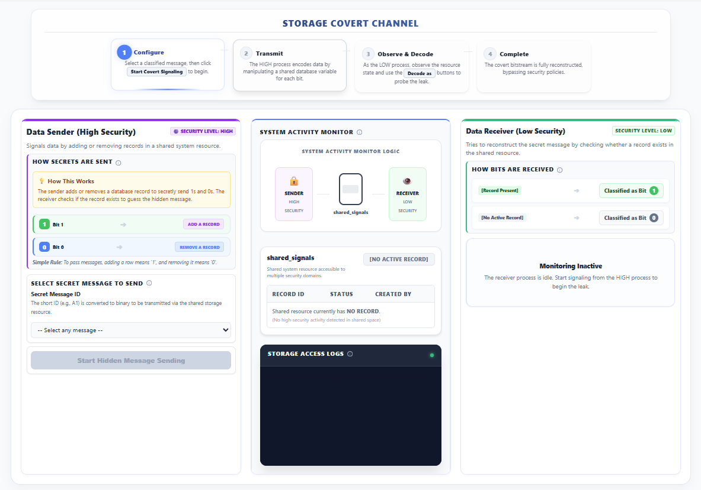
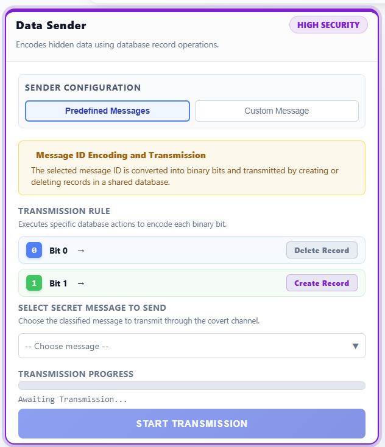
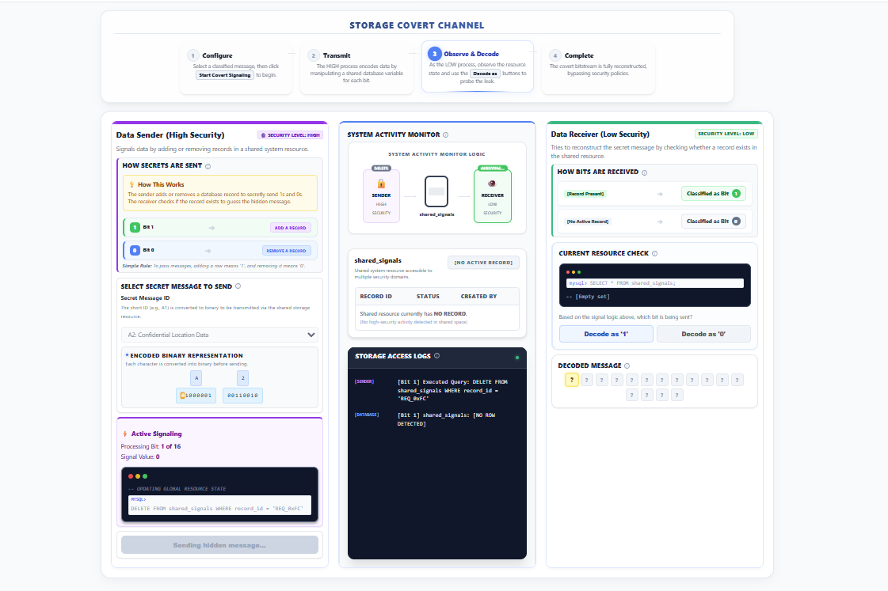
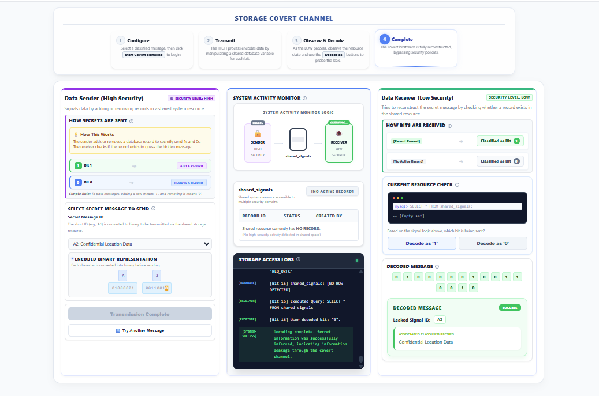
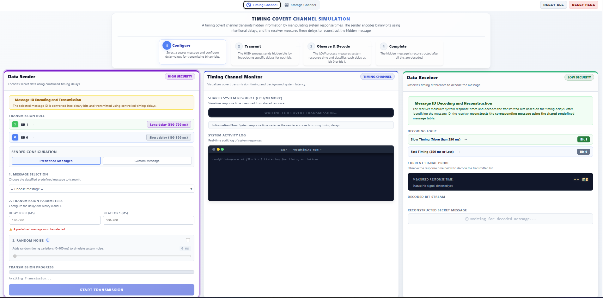
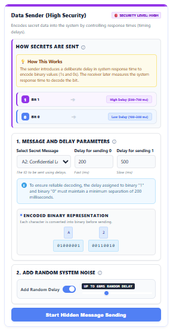
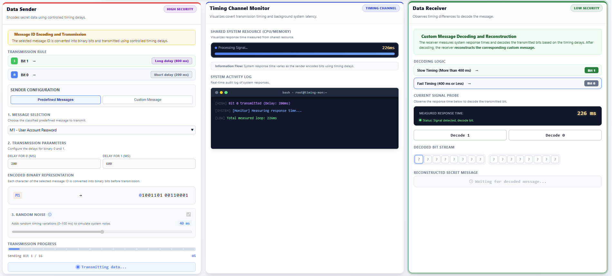
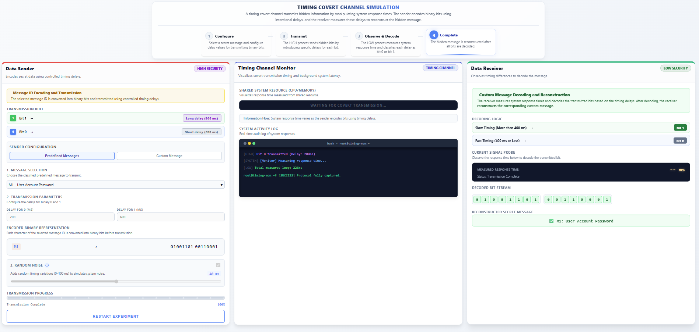

<h4>Introduction to Covert Channels</h4>

<ol>
  <li>observe the <strong>Introduction: Why Covert Channels are Used</strong> panel which outlines the sequence of attempting a direct but restricted data transfer.</li>

  <li>In the <strong>left panel ( HIGH SECURITY - Data Sender)</strong>:
    <ul>
      <li>Select a piece of sensitive data (e.g., "User Account Password") from the list.</li>
      <li>Click <strong>Attempt Data Transfer</strong>.</li>
    </ul>
  </li>

  <li>In the <strong>center panel (Reference Monitor - KERNEL MODE)</strong>:
    <ul>
      <li>Observe that the system evaluates the request against the <strong>Mandatory Access Control (MAC)</strong> policy.</li>
      <li>Note that the <strong>No-Write-Down</strong> rule (Bell-LaPadula model) is enforced, and the request is blocked.</li>
    </ul>
  </li>

  <li>In the <strong>right panel ( LOW SECURITY - Data Receiver)</strong>:
    <ul>
      <li>Observe that the Input Stream displays <strong>Access Denied — Transfer Blocked</strong>, indicating that the primary transfer mechanism is controlled.</li>
    </ul>
  </li>

  <li>At the <strong>bottom section of the screen</strong>, review the <strong>System Kernel Logs</strong> to observe how the kernel records the security violation.</li>

  <li>Click <strong>Simulate Covert Channel</strong> to proceed to specialized simulations for bypassing these direct controls.</li>
</ol>

<h4>1. Storage Covert Channel</h4>

<ul>
  <li>In the <strong>top navigation area</strong>, select the <strong>Storage Channel</strong> option.</li>
</ul>

<strong>Step 1: Sender Phase – Configure and Start Transmission</strong>

<ul>
  <li>In the <strong>left panel (DATA SENDER - HIGH SECURITY)</strong>, configure the transmission:
    <ul>
      <li><strong>Message Type:</strong> Choose between <strong>Predefined Messages</strong> (select a classified ID like M1, M2) or <strong>Custom Message</strong> (enter your own secret text).</li>
      <li>Observe the <strong>Binary Conversion</strong> display, which shows how the message is converted into a sequence of bits (0s and 1s).</li>
      <li>Review the <strong>Transmission Rule</strong>:
        <ul>
          <li><strong>Bit 1</strong>: The sender executes an <code>INSERT</code> query to add a record to the shared database.</li>
          <li><strong>Bit 0</strong>: The sender executes a <code>DELETE</code> query to remove the record from the shared database.</li>
        </ul>
      </li>
      <li>Click <strong>START TRANSMISSION</strong> to begin leaking the data bit-by-bit.</li>
    </ul>
  </li>
</ul>

<strong>Step 2: Observation Phase – Monitor Shared Resource</strong>

<ul>
  <li>In the <strong>center panel (SYSTEM RESOURCE - SHARED DB)</strong>:
    <ul>
      <li>Observe the <strong>Database Table</strong> visualization. A row appearing indicates a <strong>Bit 1</strong> signal, while an empty table indicates a <strong>Bit 0</strong> signal.</li>
      <li>Monitor the <strong>System Activity Log</strong> (bash terminal) to see the real-time SQL queries (<code>INSERT</code>/<code>DELETE</code>) being executed by the HIGH process.</li>
    </ul>
  </li>
</ul>

<strong>Step 3: Receiver Phase – Decode and Reconstruct Message</strong>

<ul>
  <li>In the <strong>right panel (DATA RECEIVER - LOW SECURITY)</strong>:
    <ul>
      <li>The receiver monitors the <strong>Resource State</strong> in the <strong>Current Signal Probe</strong>.</li>
      <li><strong>Manually Decode</strong> each bit:
        <ul>
          <li>Click <strong>Decode 1</strong> if you observe the record exists in the shared table.</li>
          <li>Click <strong>Decode 0</strong> if you observe the record is absent.</li>
        </ul>
      </li>
      <li>Observe the <strong>Decoded Bit Stream</strong> filling up as you identify each bit.</li>
      <li>Verify the final <strong>Reconstructed Secret Message</strong> matches the original secret sent by the HIGH process.</li>
    </ul>
  </li>
</ul>

<h4>2. Timing Covert Channel</h4>

<ul>
  <li>In the <strong>top navigation bar</strong>, select the <strong>Timing Channel</strong> option.</li>
</ul>

<strong>Step 1: Sender Phase – Configure Timing Parameters</strong>

<ul>
  <li>In the <strong>left panel (DATA SENDER - HIGH SECURITY)</strong>:
    <ul>
      <li><strong>Message Type:</strong> Select either <strong>Predefined Messages</strong> or <strong>Custom Message</strong>.</li>
      <li><strong>Configure Delays:</strong> Set the timing intervals for transmission:
        <ul>
          <li><strong>Delay for 1</strong>: Set a longer delay (e.g., 500-700ms).</li>
          <li><strong>Delay for 0</strong>: Set a shorter delay (e.g., 100-300ms).</li>
        </ul>
      </li>
      <li><strong>Random Noise (Optional):</strong> Enable to simulate real-world system jitter and see how it affects decoding accuracy.</li>
      <li>Click <strong>START TRANSMISSION</strong>.</li>
    </ul>
  </li>
</ul>

<strong>Step 2: Observation Phase – Observe System Latency</strong>

<ul>
  <li>In the <strong>center panel (SYSTEM MONITOR)</strong>:
    <ul>
      <li>Observe the <strong>Shared System Resource</strong>. The animation shows varying processing times for each request.</li>
      <li>Notice how the HIGH process intentionally creates measurable "waits" to signal data through CPU usage timing.</li>
    </ul>
  </li>
</ul>

<strong>Step 3: Receiver Phase – Measure and Recover Data</strong>

<ul>
  <li>In the <strong>right panel (DATA RECEIVER - LOW SECURITY)</strong>:
    <ul>
      <li>Monitor the <strong>Operation Duration</strong> recorded in milliseconds.</li>
      <li><strong>Deduce the Bit:</strong>
        <ul>
          <li>Press <strong>Decode 1</strong> if a <strong>long delay</strong> is measured.</li>
          <li>Press <strong>Decode 0</strong> if a <strong>short delay</strong> is measured.</li>
        </ul>
      </li>
      <li>Continue until the <strong>Decoded Bit Stream</strong> is complete and the <strong>Reconstructed Secret Message</strong> is displayed.</li>
    </ul>
  </li>
</ul>

