<h4>Introduction to Covert Channels</h4>

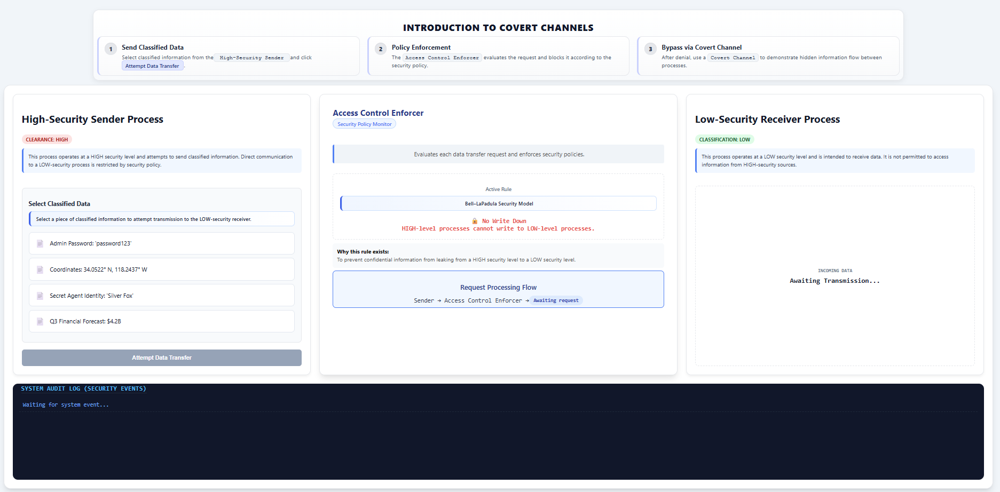

<ol>
  <li>At the <strong>top section of the screen</strong>, observe the <strong>Introduction to Covert Channels</strong> panel.</li>

  <li>In the <strong>left panel (High-Security Sender Process)</strong>:
    <ul>
      <li>Select a piece of classified information from the list.</li>
      <li>Click <strong>Attempt Data Transfer</strong>.</li>
    </ul>
  </li>

  <li>In the <strong>center panel (Access Control Enforcer)</strong>:
    <ul>
      <li>Observe that the request is evaluated according to the security policy.</li>
      <li>Note that the <strong>No Write Down</strong> rule is enforced and the request is blocked.</li>
    </ul>
  </li>

  <li>In the <strong>right panel (Low-Security Receiver Process)</strong>:
    <ul>
      <li>Observe that the incoming data displays <strong>NULL (WRITE DENIED)</strong>, indicating that the security policy has blocked the transfer.</li>
    </ul>
  </li>

  <li>At the <strong>bottom section of the screen</strong>, review the <strong>System Audit Log</strong> to observe how the system records the blocked attempt.</li>

  <li>Click <strong>Next: Covert Channel</strong> to proceed to the covert channel simulation.</li>
</ol>

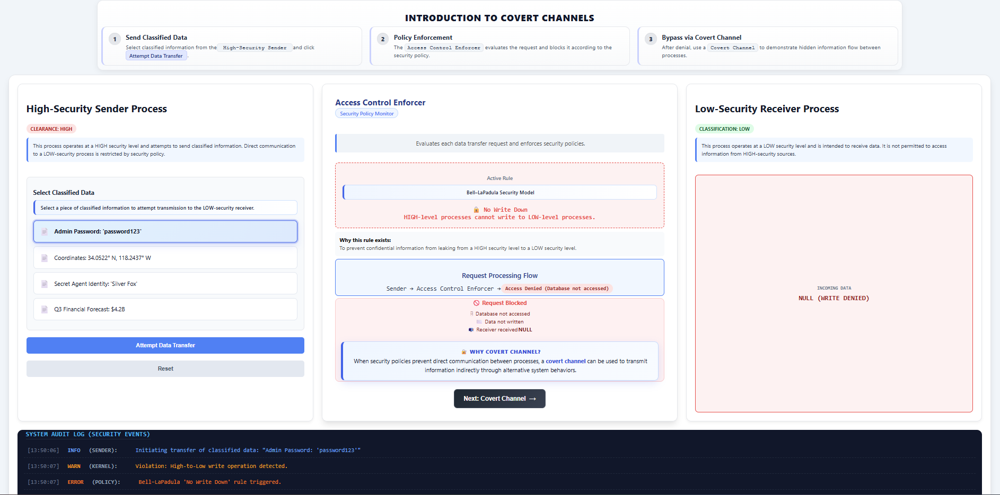

<h4>1. Storage Covert Channel</h4>

<ul>
  <li>In the <strong>top navigation area</strong>, select the <strong>Storage Covert Channel</strong> option.</li>
</ul>

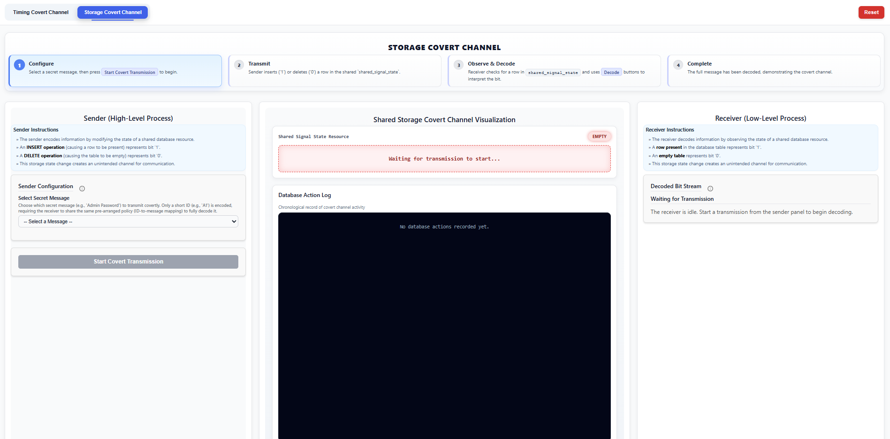

<strong>Step 1: Sender Phase – Prepare and Start Transmission</strong>

<ul>
  <li>In the <strong>left panel (Sender – High-Level Process)</strong>:
    <ul>
      <li>Read the displayed sender instructions.</li>
      <li>Select a secret message from the <strong>Select Secret Message</strong> dropdown.</li>
      <li>Observe the <strong>ID to Binary Conversion</strong> displayed directly below the selection.</li>
    </ul>
  </li>
</ul>

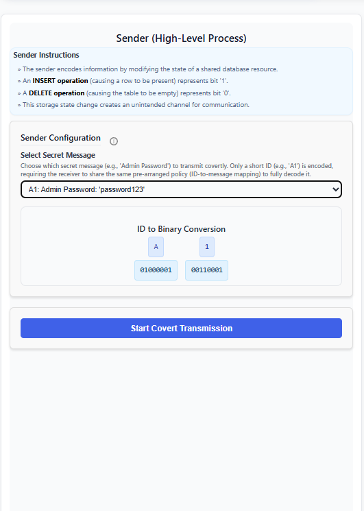

<ul>
  <li>Click <strong>Start Covert Transmission</strong>.</li>

  <li>During transmission, monitor the <strong>Current Sender Action</strong> section in the left panel.</li>

  <li>Note that:
    <ul>
      <li>A database <strong>INSERT</strong> operation represents bit <code>1</code>.</li>
      <li>A database <strong>DELETE</strong> operation represents bit <code>0</code>.</li>
    </ul>
  </li>
</ul>

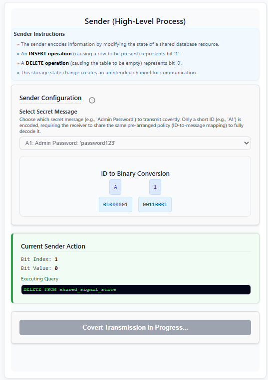

<strong>Step 2: Visualization Phase – Observe Shared Storage and Logs</strong>

<ul>
  <li>In the <strong>center panel (Shared Storage Covert Channel Visualization)</strong>:
    <ul>
      <li>Observe the <strong>Shared Signal State Resource</strong>.</li>
      <li>The visualization indicates whether a row is present (representing bit <code>1</code>) or the table is empty (representing bit <code>0</code>).</li>
    </ul>
  </li>

  <li>Below the visualization, monitor the <strong>Database Action Log</strong>, which records each covert channel operation (INSERT or DELETE) in chronological order.</li>
</ul>

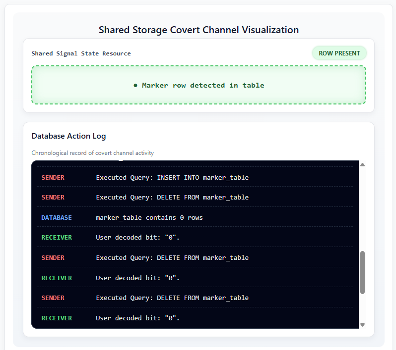

<strong>Step 3: Receiver Phase – Decode and Recover the Message</strong>

<ul>
  <li>In the <strong>right panel (Receiver – Low-Level Process)</strong>:
    <ul>
      <li>Observe the database query result under <strong>Database Observation</strong>.</li>
      <li>Decode each bit by clicking <strong>Decode 1</strong> when a row is present, or <strong>Decode 0</strong> when the table is empty.</li>
    </ul>
  </li>
</ul>

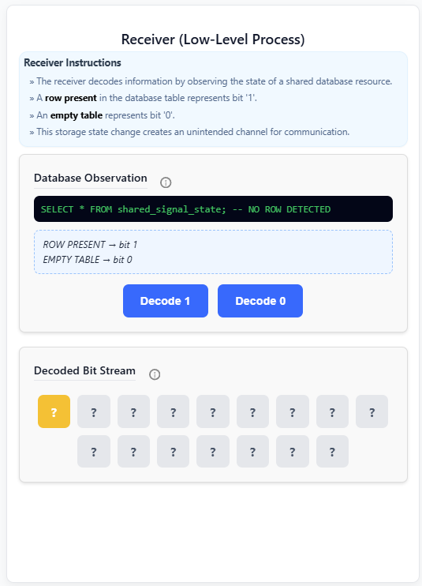

<ul>
  <li>Observe the decoded bits appearing in the <strong>Decoded Bit Stream</strong> section.</li>
  <li>If a mismatch occurs, click <strong>Resume Decoding from Mismatch</strong> and continue the decoding process.</li>
  <li>When the process is complete, verify that the system displays <strong>Transmission Complete</strong>, indicating successful recovery of the hidden message.</li>
</ul>

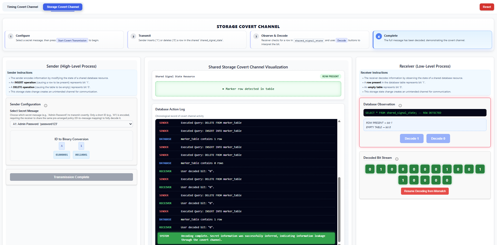

<h4>2. Timing Covert Channel</h4>

<ul>
  <li>In the top navigation bar, select <strong>Timing Covert Channel</strong>.</li>
</ul>

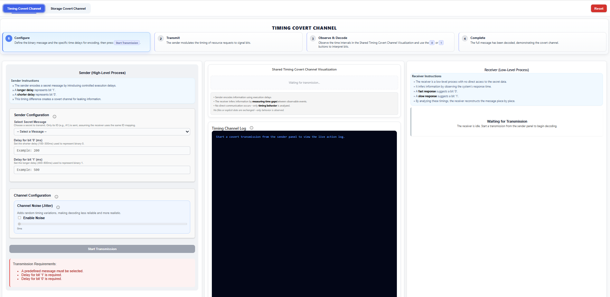

<strong>Step 1: Sender Phase – Encode and Start Transmission</strong>

<ul>
  <li>In the <strong>Sender (High-Level Process)</strong> panel:
    <ul>
      <li>Select a secret message from the dropdown list.</li>
      <li>Configure the timing parameters:
        <ul>
          <li>Delay for bit <code>0</code></li>
          <li>Delay for bit <code>1</code></li>
          <li>Optional noise (jitter) to simulate real-world timing variability</li>
        </ul>
      </li>
      <li>Click <strong>Start Transmission</strong>.</li>
    </ul>
  </li>
</ul>

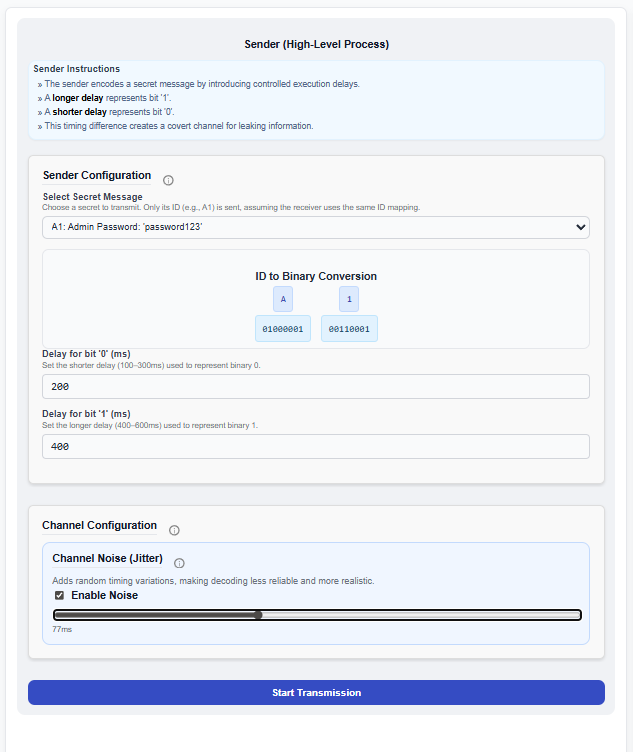

<strong>Step 2: Visualization Phase – Observe Timing Delays</strong>

<ul>
  <li>In the <strong>Shared Timing Covert Channel Visualization</strong> panel:
    <ul>
      <li>Observe the response time for each transmitted bit.</li>
      <li>Notice how the timing pattern reveals the hidden information, where longer or shorter delays correspond to bits <code>0</code> or <code>1</code>.</li>
    </ul>
  </li>
</ul>

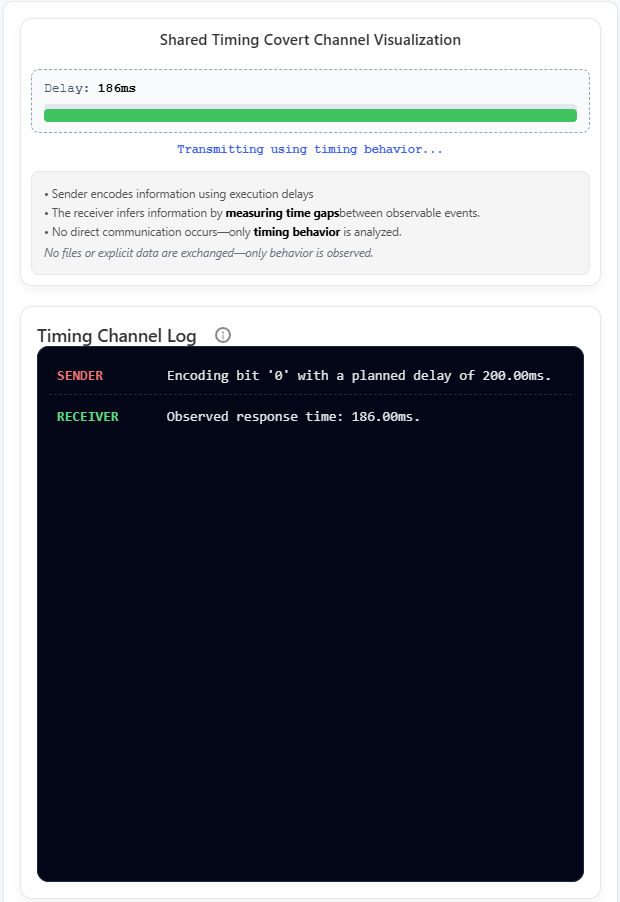

<strong>Step 3: Receiver Phase – Decode and Recover the Message</strong>

<ul>
  <li>In the <strong>Receiver (Low-Level Process)</strong> panel:
    <ul>
      <li>Compare each observed response time against the expected delay ranges for bits <code>0</code> and <code>1</code>.</li>
      <li>Classify each bit manually by clicking <strong>0</strong> or <strong>1</strong> based on the measured timing.</li>
    </ul>
  </li>
</ul>

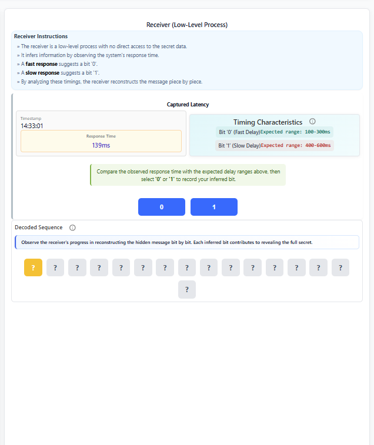

<ul>
  <li>Monitor the <strong>Decoded Sequence</strong>, which updates in real time as each bit is classified.</li>
  <li>Continue decoding until all bits have been processed.</li>
  <li>Upon completion:
    <ul>
      <li>Observe the final <strong>Decoded Message</strong> displayed on the screen.</li>
      <li>Review the <strong>Timing Channel Log</strong> to analyze how timing variations enabled the transmission of hidden data.</li>
    </ul>
  </li>
</ul>

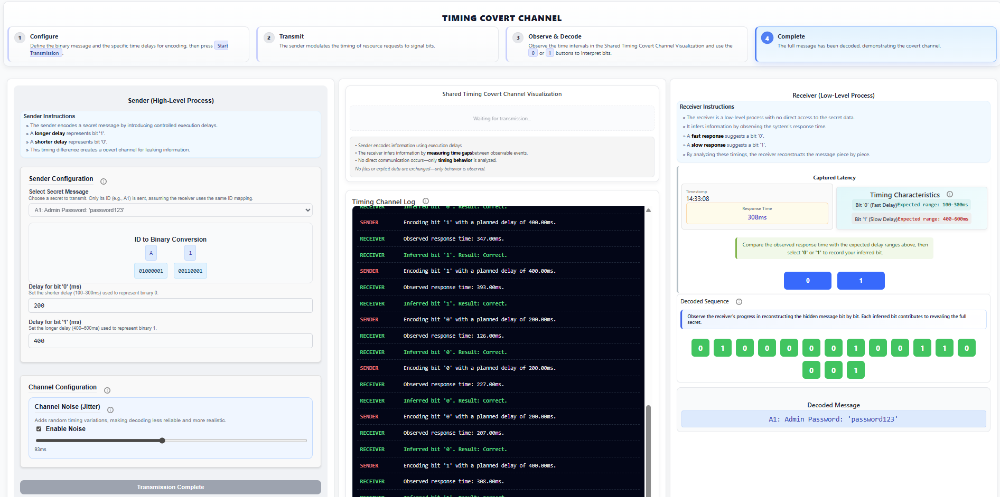